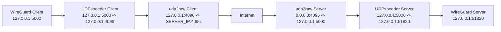

# SecretWireguard

SecretWireguard is a Docker-based WireGuard stack that runs:

- WireGuard
- UDPspeeder
- udp2raw

It is designed for legitimate administration, testing, and interoperability work on systems and networks you control.

## Traffic flow



## Directory layout

```text
SecretWireguard/
├── README.md
├── image/
│   ├── Dockerfile
│   └── scripts/
│       ├── entrypoint.sh
│       ├── parse-udpspeeder-conf.sh
│       ├── run-client.sh
│       └── run-server.sh
├── server/
│   ├── .env.example
│   ├── compose.yml
│   └── config/
│       ├── udp2raw/
│       │   └── server.conf
│       ├── udpspeeder/
│       │   └── server.conf
│       └── wg_confs/
│           └── wg0.conf
└── client/
    ├── .env.example
    ├── compose.yml
    └── config/
        ├── udp2raw/
        │   └── client.conf
        ├── udpspeeder/
        │   └── client.conf
        └── wg_confs/
            └── wg0.conf
```

## Prerequisites

- Docker
- Docker Compose plugin
- Linux host with WireGuard support
- Permission to use host networking and raw socket features on the host
- `wg` command available either on the host, or use the LinuxServer WireGuard container for key generation only

## Initial setup

Copy the example environment files:

```bash
cp server/.env.example server/.env
cp client/.env.example client/.env
```

Then edit the configuration files and replace all placeholder values.

## Generate WireGuard keys

You can use the LinuxServer WireGuard container to generate WireGuard keys.

### Server keypair

```bash
docker run --rm -it lscr.io/linuxserver/wireguard:latest sh -lc '
umask 077
wg genkey | tee /tmp/server_private.key | wg pubkey > /tmp/server_public.key
echo "SERVER_PRIVATE_KEY=$(cat /tmp/server_private.key)"
echo "SERVER_PUBLIC_KEY=$(cat /tmp/server_public.key)"
'
```

### Client keypair

```bash
docker run --rm -it lscr.io/linuxserver/wireguard:latest sh -lc '
umask 077
wg genkey | tee /tmp/client_private.key | wg pubkey > /tmp/client_public.key
echo "CLIENT_PRIVATE_KEY=$(cat /tmp/client_private.key)"
echo "CLIENT_PUBLIC_KEY=$(cat /tmp/client_public.key)"
'
```

### WireGuard preshared key

```bash
docker run --rm -it lscr.io/linuxserver/wireguard:latest sh -lc '
umask 077
wg genpsk > /tmp/preshared.key
echo "PRESHARED_KEY=$(cat /tmp/preshared.key)"
'
```

## Generate a cryptographically secure udp2raw password

Use your host system directly:

```bash
head -c 32 /dev/urandom | base64
```

Labelled output:

```bash
echo "UDP2RAW_PASSWORD=$(head -c 32 /dev/urandom | base64)"
```

Save to a file with restricted permissions:

```bash
umask 077
head -c 32 /dev/urandom | base64 > udp2raw_password.txt
cat udp2raw_password.txt
```

## Generate a cryptographically random port above 1024

Use your host system directly:

```bash
PORT=$(( ( $(od -An -N2 -tu2 /dev/urandom) % 64511 ) + 1025 ))
echo "${PORT}"
```

## Recommended initial values

A sensible starting point:

- WireGuard MTU: `1200`
- UDPspeeder mode: `0`
- UDPspeeder mtu: `1200`

If you still see oversized packet warnings, reduce WireGuard MTU to `1100`.

## Build and start

### Server

```bash
cd server
docker compose up -d --build
```

### Client

```bash
cd client
docker compose up -d --build
```

## Check logs

```bash
docker logs -f secretwireguard-server
docker logs -f secretwireguard-client
```

## Check listeners

```bash
docker exec -it secretwireguard-server sh -lc 'ss -lnptu | grep -E "4096|5000|51820"'
docker exec -it secretwireguard-client sh -lc 'ss -lnptu | grep -E "4096|5000|51820"'
```

## Check WireGuard status

```bash
docker exec -it secretwireguard-server wg show
docker exec -it secretwireguard-client wg show
```

## Test connectivity

```bash
docker exec -it secretwireguard-client ping -c 3 10.8.0.1
```

## Config files to edit

Replace placeholders in these files:

- `server/config/wg_confs/wg0.conf`
- `client/config/wg_confs/wg0.conf`
- `server/config/udp2raw/server.conf`
- `client/config/udp2raw/client.conf`
- `server/config/udpspeeder/server.conf`
- `client/config/udpspeeder/client.conf`

## Security notes

- Never commit private keys or shared secrets into git.
- Restrict config files with appropriate file permissions.
- Host networking and raw socket tooling are powerful; use only where appropriate.
- Keep exposed ports minimal and explicitly firewall them on the host.
